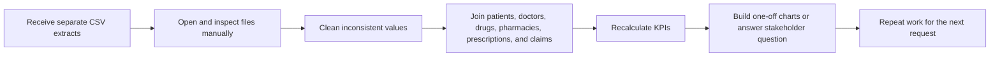
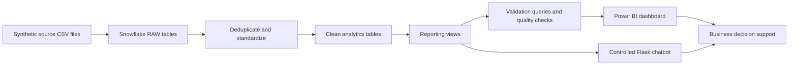
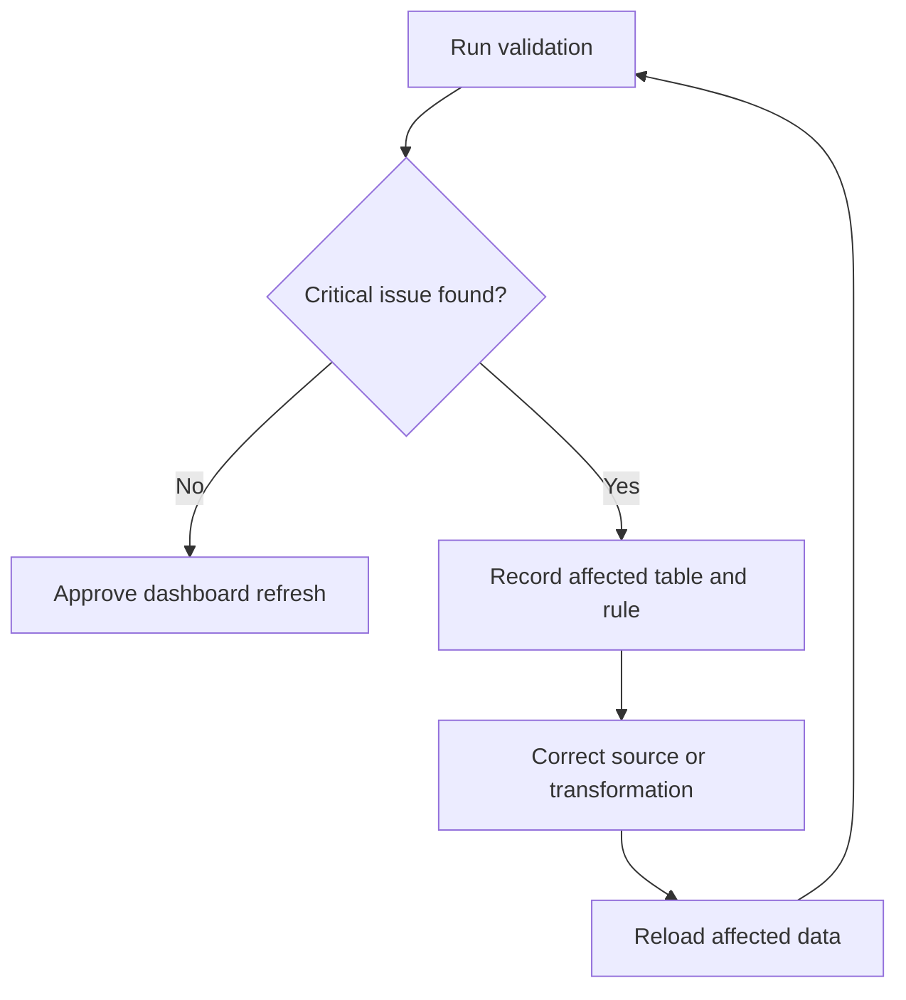

# MedScope Current-State and Future-State Process Flows

## Current-State Business Process

The starting point for this project was a set of separate CSV extracts. Without a shared warehouse model, an analyst would repeat the following work for each request.

Problems with that approach:

- Repeated manual preparation.
- Risk of inconsistent joins and calculations.
- Slow response to stakeholder questions.
- No single definition of KPIs such as total prescription cost.
- Limited audit trail for cleaning and validation.

## Future-State MedScope Process

## Proposed Refresh Sequence

1. Confirm that all six expected source files are present.
2. Upload the files to the Snowflake internal stage.
3. Run the RAW load script.
4. Run the clean-layer transformations.
5. Rebuild analytics views.
6. Execute SQL and Python validation checks.
7. Investigate critical validation failures.
8. Refresh the Power BI model only after validation approval.
9. Reconcile the headline KPIs and quickly test the main filters before sharing the report.

## Exception Flow

## Responsibility Summary

This is a lightweight RACI-style view for the project. Exact job titles may change in a real organization.

| Activity | Business owner | Data/BI owner | Reviewer |
| --- | --- | --- | --- |
| Define KPIs and business rules | Accountable | Consulted | Consulted |
| Load and transform data | Informed | Responsible | Informed |
| Validate joins and financial logic | Consulted | Responsible | Accountable |
| Build dashboard visuals | Consulted | Responsible | Consulted |
| Conduct UAT | Accountable | Supports | Responsible |
| Approve release/refresh | Accountable | Informed | Consulted |
